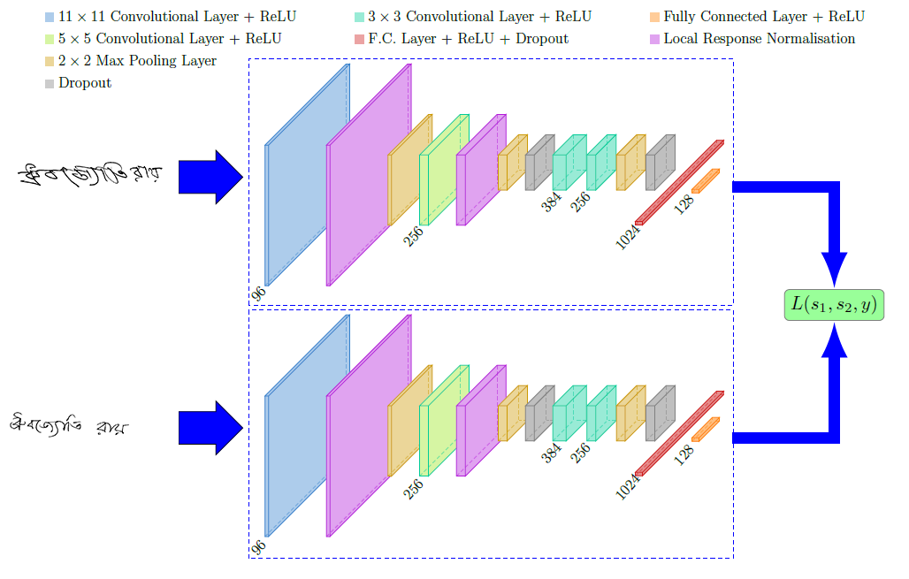

# Bengali-and-Hindi-Signature-Verification-using-Convolution-Siamese-Network
 
 
   

### Abstract

Verification of off-line signatures is one of the most challenging tasks in biometrics and document forensic science. In this thesis, we deal with Convolutional Siamese Network model which is capable of doing verification of Bengali and Hindi Signature. One particular advantage of Siamese Neural networks is the ability to generalize to new classes that it has not been trained on, and in fact, the number of classes that it is expected to support does not have to be known at training time. Also, the architecture commonly known as the Siamese network helped reduce the amount of training data needed for its implementation. The twin networks with shared weights were trained to learn feature space where similar observations are placed in proximity. Writer Independent verification model has been designed where an accuracy of 91.82% has been obtained for Bengali Dataset and 84% for Hindi Dataset

### Dataset Samples

#### Bengali

 
  
 
#### Hindi

  
  

### Architecture

### Prediction

#### Bengali

#### Hindi

Read the <a href="">Bachelor's Thesis</a> in  format.  
Run the <a href="CODE.ipynb"><code>Jupyter Notebook</code></a> to do the experiment on your own.

